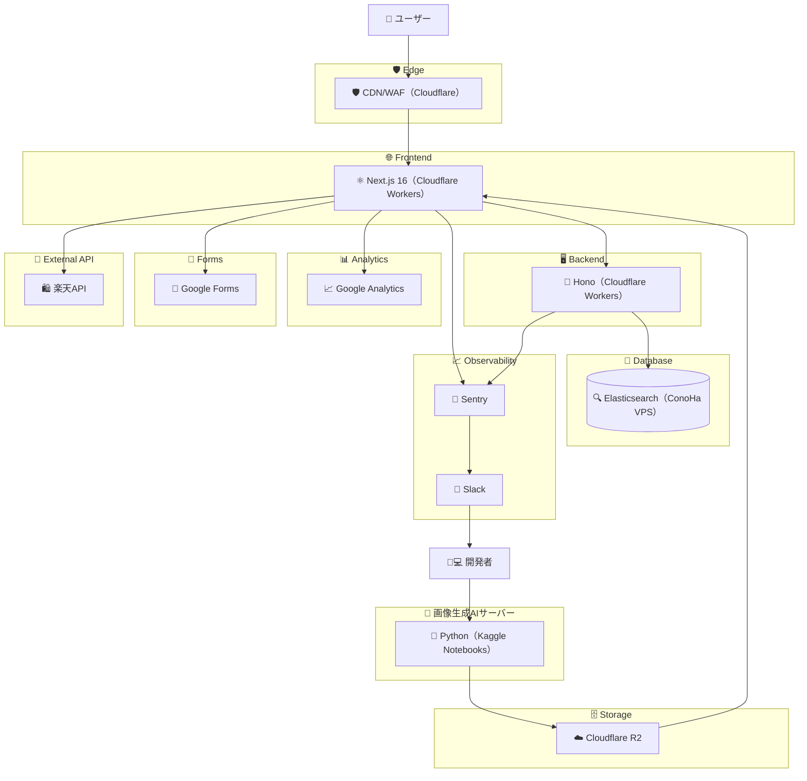

#### 概要

しっくりくるファッションサイトがなかったので AI でコーディネートするサイトを作りました

#### 使用技術

- Hosting
  - Cloudflare Workers(フロント、バックエンド両方とも)
  - ConoHa VPS(Elasticsearch)
  - Kaggle Notebooks
- Framework
  - Next.js
  - .Hono
- Program
  - React
  - TypeScript
  - Python
- Storage
  - Cloudflare R2
- DB
  - Elasticsearch
- AI
  - StableDiffusion

#### 技術選定の背景

ざっくりですがここに書いています

https://qiita.com/ikuosaito1989/items/8e6dff394d052655fed2
