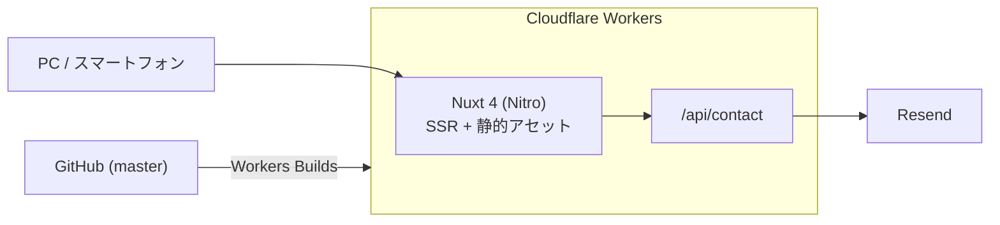

#### 概要
~NuxtJs、Vueの学習用に作成しました。この程度のプロフィールサイトであれば、バックエンドは不要ですが
勉強としてモックサーバーもふくめて作りました。~

学習用に作ったサイトですが、その後 Nuxt 4 へ移行し、バックエンド（.NET Core のモックサーバー）は廃止しました。
現在はプロフィールの静的データをリポジトリに直接持ち、Cloudflare Workers 1つで完結しています。
外部通信が必要なのはお問い合わせメールの送信だけです。

#### アーキテクチャ

現在の構成です。

~以前の構成（Netlify + Heroku）~

#### 使用技術

- Cloud
  - Cloudflare Workers
  - ~Netlify~
  - ~Azure App Service~
- ~Middreware~
  - ~Docker~
- Framework
  - Nuxt 4
  - ~NuxtJS 2.13~
  - ~.NET Core 3.1~
- Program
  - Vue 3
  - TypeScript
  - ~C#~
- ~Test~
  - ~Jest~
- CI/CD
  - Cloudflare Workers Builds
  - ~Netlify~
- Mail
  - Resend
  - ~Send Grid~

#### 技術選定の背景

- Nuxt

~仕事で使うことになり、勉強がてらこのプロフィールサイトを作りました。Angularに比べ、エコシステムの充実さ、軽量、CoC原則に則った作りなどメリットが多く、一番得意で好きなフロントフレームワークになりました。~

もともと仕事で使うことになり、勉強がてらこのプロフィールサイトを作りました。Nuxt 2 のサポートが終了したため Nuxt 4 に移行しています。ディレクトリ構成が `app/` 配下に整理され、Nitro のおかげでデプロイ先を選ばなくなったのが大きいです。

- ~Netlify~

~SPAであれば無料で使えるので選定しました。Githubとの連携でデプロイ出来るので楽で良いと思いました。~

- ~Heroku~

~ホビープランなら無料なので、C#をコンテナ化しHeroku Container Registryを使ってデプロイしています。~
無料プランが廃止されることになりました。もともと学習のためにこのプロフィールサイトにAPIを用意していただけなので
出来るだけコストを抑えたく無料プランがなくなった今はAzure App Serviceを利用することになりました。
ありがとうHeroku。

- ~Azure App Service~

~無料プランがあり、アクセスが少ないプロフィールサイトであれば十分に事足りると判断し、Herokuから切り替えました。~

- Cloudflare Workers

フロントとAPIを別々のサービスにホスティングする必要がなくなったので、Workers 1つにまとめました。無料枠で足り、エッジで動くので速く、`master` への push で Workers Builds が自動デプロイしてくれます。Netlify と Azure App Service の2つを管理する必要がなくなりました。

- Resend

SendGrid の無料プランが実質使えなくなったため乗り換えました。APIがシンプルで、Workers から `fetch` するだけで送信できるのが決め手です。

#### こだわり

- ~カバレッジ100%~

~あくまで勉強用なのでカバレッジ100%を必須としています。~

バックエンドを廃止してロジックがほぼなくなったため、テストは一旦外しています。

- マークダウン

ポートフォリオのページはマークダウンでかけるようにしています。どのフォーマットでも対応でき、変更しやすいのがよかったと思います。図もmermaidで書けるようにしました。
